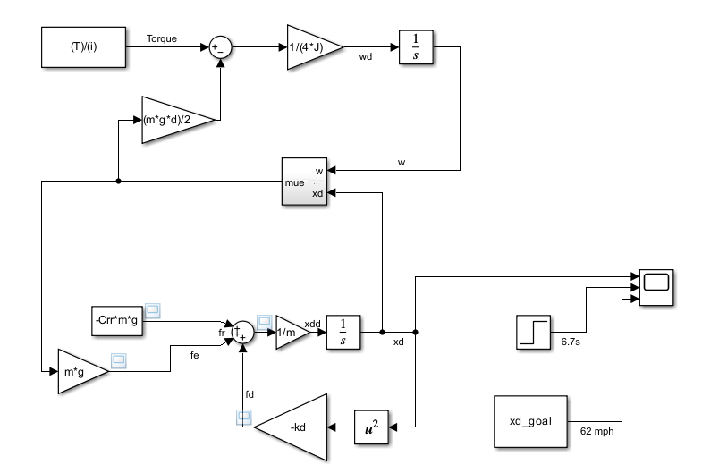
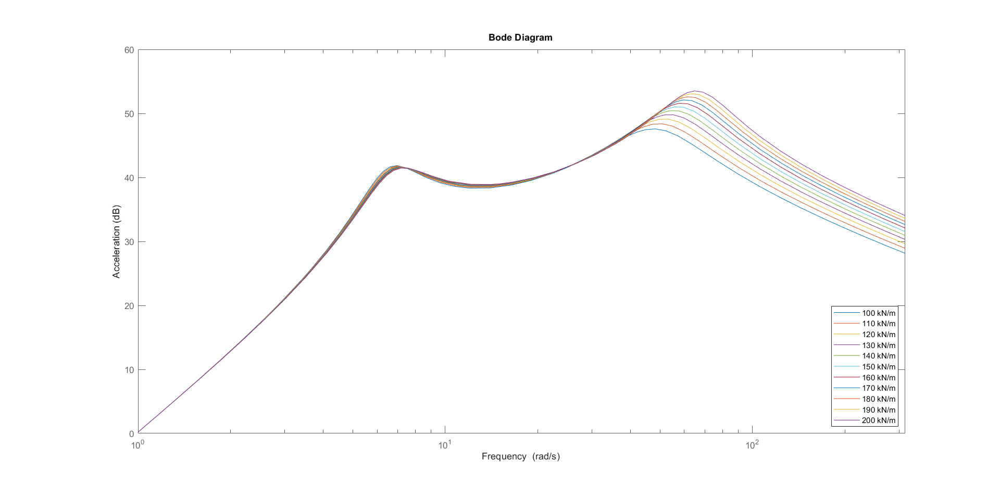
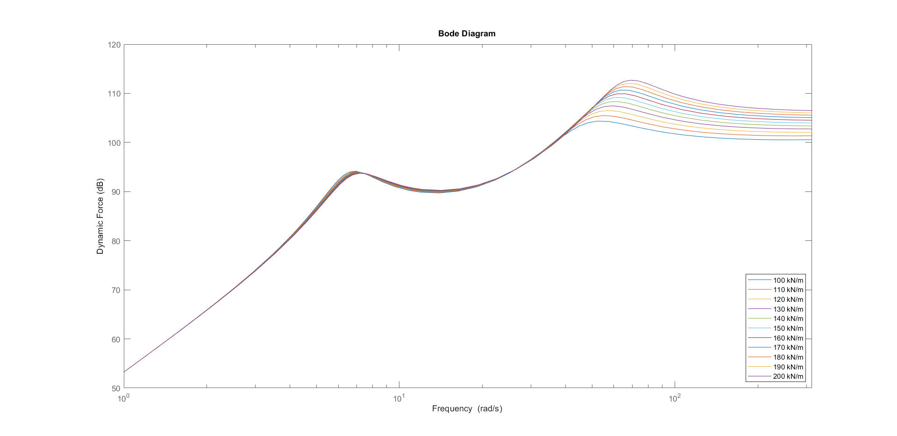

# Investigations of Vehicle Dynamics

# Investigations

## 0.0 Audi Longitudinal Kinematics

### 0.0.1 Specifications

- We want to simulate accleration 0 - 60 kph (16.67 m/s)
    - plot a graph of speed vs time and see if the time is actually 6.7s
    - we use the data from the data sheet

### 0.0.2 Assumptions

1. No incline
2. Equilibrium at maximum speed 
3. Full electric vehicle → torque is constant 
4. Rolling resistance is constant and take maximum value for worst case scenario 
5. Tyre Class C1 w/ Fuel Efficiency class A [2] 
6. Negligble tyre deformation thoughout acceleration 
7. Road is dry 
8. Assume gear ratio is the same (not true but still)

### 0.0.3 Parameters

- Mass: $m = 2145 kg$ [1]
- Maximum torque $\mathcal{T}= 545 Nm$ [1] *3
- Maximum speed 112 mph $\dot{x}^{max}= 50.0685 m/s$  [1]
- Drag Factor $k_d=0.8233\frac{kg}{m}$
- Initial speed $\dot{x}_0=0 m/s$
- Tire diameter: $d=0.4953 m$ [2] *6
- $C_{rr}=0.0065$ [3], *4 *5
- Gear box ratio: $i=0.1$ [4] *8

### 0.1.0 Equations

$$
\ddot{x}=\frac{2\mathcal{T}}{d\cdot m\cdot i}-C_{rr}\cdot g-\frac{k_d \cdot\dot{x}^2}{m}  \quad (1)
$$

### 0.1.1 Simulation Model

### 0.2.0 Results

- We get around 40 m/s at 6.7s

### 0.3.0 Issues

- We failed to account for the driving slip which would have lowered the acceleration
- Gear box ratio could also hv degradation

### 0.4.0 Rework



Using the friction model of 1.0, we derived a new set of ODEs and formed the simulation as shown.


The results were much closer.

## 1.0 Tire Model

### 1.0.1 Specifications

Develop a model to meet the data points for tire slip in icy and wet conditions. The Pacejka model will be used and for different conditions, the model parameters will be found. 

$$
\mu(\kappa)=c_1\left[1-e^{-c_2\kappa}\right]-c_3\kappa
$$

### 1.0.2 Data

For icy and wet road conditions, the following information was determined experimentally. 


### 1.0.3 Parameters

| Parameters | Wet | Icy |
| --- | --- | --- |
| c1 | 0.86 | 0.2 |
| c2 | 33.078 | 6.628 |
| c3 | 0.36 | 0 |

### 1.1.0 Method of Finding Parameters

Use the fact that the linear part is asymptote of the function so the slope and intercept gives us c1 and c3. 

Then you plug in values to find c2

### 1.1.1 Programs for Pacejka Model

After the model parameters are found, they can be implemented into a Simulink model as shown. 


Simulink Model for slip calculation


Simulink Model for 

To observe the relationship between friction coefficient and slip, we also implemented a simple Matlab script to plot the graph. 

```matlab
%% Setup
% Wet
c1w=86/100;
c2w=33078/1000;
c3w=36/100;
f_mue_w = @(x)(c1w*(1-exp(-c2w*x))-c3w*x);
% Icy
c1i=2/10;
c2i=6628/1000;
c3i=0;
f_mue_i = @(x)(c1i*(1-exp(-c2i*x))-c3i*x);

%% Ploting friction against slip in different road conditions
fplot(f_mue_w,[0,1])
hold on
fplot(f_mue_i,[0,1])
hold off
grid
legend('wet','icy')
xlabel('braking slip')
ylabel('coef. of friction')
ylim([0 0.9])
```

### 1.1.2 Extension of Model for Parameterization

To see how the friction coefficient varies with different speeds of the vehicle or tires, we extended the models.

```matlab
%% Ploting friction against tire speed in different road conditions and vehicle velocities (braking)
f_slip = @(v_v,v_w)((v_v-v_w)/(v_v));
for i=5:5:50
    slip_val = f_slip(i,0:0.1:i);
    plot(0:0.1:i,f_mue_w(slip_val),"-")
    hold on
    plot(0:0.1:i,f_mue_i(slip_val),"--")
end
xlabel('Tire speed [m/s]'); ylabel('Coef. of Friction [-]')
hold off

%% Ploting friction against driving speed in different road conditions and tire velocities (accelerating)
f_slip = @(v_w,v_v)((v_w-v_v)/(v_w));
for i=5:5:50
    slip_val = f_slip(i,0:0.1:i);
    plot(0:0.1:i,f_mue_w(slip_val),"-")
    hold on
    plot(0:0.1:i,f_mue_i(slip_val),"--")
end
xlabel('Tire speed [m/s]'); ylabel('Coef. of Friction [-]')
hold off
```

### 1.2.0 Results for Model Parameters

| Parameters | Wet | Icy |
| --- | --- | --- |
| c1 | 0.86 | 0.2 |
| c2 | 33.078 | 6.628 |
| c3 | 0.36 | 0 |

### 1.2.1 Friction Slip Relationship Results


### 1.2.2 Rudimentary Observations from Model

| v_v | v_w | mue |
| --- | --- | --- |
| 40 | 38 | 0.68 |
| 30 | 28 | 0.74 |
| 30 | 22 | 0.76 |
| 40 | 22 | 0.7 |
| 60 | 22 | 0.63 |
| 30 | 30 | 0 |
| 30 | 32 | -7 |
| 15 | 10 | 0.74 |
| 15 | 5 | 0.62 |
| 15 | 14 | 0.74 |
| 100 | 15 | 0.56 |
| 100 | 80 | 0.79 |
| 100 | 90 | 0.79 |
| 100 | 99 | 0.24 |
| 100 | 50 | 0.68 |

### 1.2.3 General Graphs from Extended Model


## 2.0 Gough Diagram

### 2.0.1 Specifications

Investigating the uses of the Gough Diagram

### 2.0.2 175 HR 14 Gough Diagram


### 2.0.3 Additional Parameters


### 2.1.0 Methodoloy

Reading values of the Gough diagram to gather a sufficient data set for plotting and calculations

### 2.1.1 Script and Data Set from Gough Diagram

```matlab
a = 0:12;    % side slip angle[degree]
a2 = -12:12;
Fy_3 = [0 0.5 1.1 1.5 2.1 2.4 2.8 2.9 3.1 3.3 3.3 3.4 3.5];   % lateral force [kN]
Mz_3 = [18 25 39 42 42.5 42.5 41 39 35 30 24 19];    % aligning torque [Nm]
Fy_4 = [0 0.8 1.15 1.8 2.3 2.6 3.1 3.3 3.5 3.7 3.9 4.1 4.15];
Mz_4 = [25 43 61 65 72 75 73 70 65 60 50 45];
Mz_5 = [39 67 87 101 108 110 112 110 105 100 95 82];

Fy = [-1*flip(Fy_3) Fy_3; ... 
			-1*flip(Fy_4) Fy_4];
plot(a2,Fy);
xlabel("side slip angle [degrees]")
ylabel("Lateral Force [kN]")
grid
legend("Fz = 3kN","Fz = 4kN")

figure

Mz=[-1*flip(Mz_3) 0 Mz_3; ...
    -1*flip(Mz_4) 0 Mz_4; ...
    -1*flip(Mz_5) 0 Mz_5];
plot(a2,Mz);
xlabel("side slip angle [degrees]")
ylabel("Aligning Torque [Nm]")
grid
legend("Fz = 3kN","Fz = 4kN","Fz = 5kN")
```

### 2.2.0 Graphs of Lateral Force and Alligning Torque


## 3.0 Quarter Car Model

### 3.0.0.1 Specifications

Developing the Quarter Car modelling from ordinary differential equations to simulink model. Then extending the model to account for road disturbances. 

With the flat road model, investigating:

1. Response after a force step after 10 seconds
2. Response from parameter variation 

With the road excitation model, investigating:

1. Response for a sinusoidal excitation of 20mm at 2 Hz frequency.
2. Frequency domain characteristics 

### 3.0.0.2 Model Diagrams


### 3.0.0.3 Assumptions

### 3.0.0.4 Parameters


### 3.0.1.0 Formulation of Differential Equations


### 3.0.1.1 Final Equations

### 3.0.1.2 Simulink Models


Simulink Model for Quarter Car with Road Excitation

### 3.0.1.3 Laplace Transform


### 3.0.2.0 Observations from Parameter Modification w/o Road Excitation


200 kg less


40000 N/m more


3000 damping more


400000 spring 3000 damping


10 stiffness


15 damping

### 3.0.2.1 Observations from Frequency Modification


with the integrator


with the derivative


2 rad/s


3 rad/s


4 rad/s


5 rad/s


6 rad/s


7 rad/s


7.071 rad/s Natural frequency 


8 rad/s


9 rad/s


10 rad/s


10 rad/s


2, 4, 6, 8, 10 Hz


2 Hz


5 Hz


8 Hz


10 Hz


2 Hz, 5s


5 Hz, 5s


8 Hz, 5 secs


10 Hz, 5 s


100 Hz

### 3.0.2.2 Frequency Domain Characteristics


From using Simulink 


From using bode()

![Psuedo Bode Plot of Amplitude (z [m] vs w [rad/s] )](assets/image%2055.png)

Psuedo Bode Plot of Amplitude (z [m] vs w [rad/s] )


Pseudo Bode Plot of Phase 

## 3.1.0 Quarter Car Two Mass Model

Similar to 3.0.0, this section extends the Quarter Car Model to the dual mass variation, focusing on frequency domain characteristics and parameterisation.

### 3.1.1.? Transfer Functions

$$
G_{B_{acc}}(s)=\frac{k_W k_Bs^4+(k_W c_B+k_B c_W)s^3+c_W c_Bs^2}{m_{B}m_{W}s^{4}+[m_{B}(k_{B}+k_{W})+m_{W}k_{B}]s^{3}+[m_{B}(c_{B}+c_{W})+m_{W}c_{B}+k_{B}k_{W}]s^{2}+[k_{B}c_{W}+k_{W}c_{B}]s^{3}+c_{B}c_{W}}
$$

$$
G_{W_{acc}}(s)=\frac{m_B k_Ws^5+(k_W k_B+m_B c_W)s^4+(k_Bc_W+k_W c_B)s^3+c_Bc_Ws^2}{m_{B}m_{W}s^{4}+[m_{B}(k_{B}+k_{W})+m_{W}k_{B}]s^{3}+[m_{B}(c_{B}+c_{W})+m_{W}c_{B}+k_{B}k_{W}]s^{2}+[k_{B}c_{W}+k_{W}c_{B}]s^{3}+c_{B}c_{W}}
$$


### 3.1.2.? Frequency Domain Characteristics


### 3.1.2.? Wheel Mass Variation


### 3.1.2.? Tire Stiffness Variation






### 3.1.2.? Body Stiffness Variation


### 3.1.2.? Body Damping


### 3.1.2.? Body Mass Variation


### 3.1.3.? Discussion of Comfort and Safety

|  | Comfort | Safety | Conclusion |
| --- | --- | --- | --- |
| Wheel Mass | Improved for higher mass at frequency above wheel eigenfrequency | Less safe for higher mass at freq.  between the eigenfrequencies | Wheel mass needs to be **balanced**  |
| Tire Stiffness | Improved for lower stiffness for frequency above wheel eigenfrequency | Improved for lower stiffness at frequency above wheel eigenfrequency | Tire should be **soft** (but **hard enough to transfer** longitudinal and lateral **forces** and be durable) |
| Body Stiffness | Improved for lower stiffness near the body eigenfrequency | Improved for lower stiffness near the body eigenfrequency | Keep the stiffness **low** but **high enough to keep the wheels on the ground** and doesn't get completely compressed |
| Body Damping | Improved for higher damping at body eigenfrequency
Less for higher damping at frequencies above body eigenfrequency $\omega>\omega_B$ | Improved for higher damping at the two eigenfrequencies 
Less safe for higher damping between the eigenfrequencies  | We need to **consider** the excitation **frequency** |
| Body Mass | Improved for higher body mass at frequencies above body eigenfrequency | Less safe for higher mass at frequencies below the wheel eigenfrequency | **Balance** the body mass  |

## 4.0 Braking Investigations

### 4.0.1 Specifications


### 4.0.2 Parameters


MB = 5350

Optimal slip = 13%, Controller Gain 20000

### 4.1.0 Formulation

### 4.1.1 Simulink Models


w/o ABS


w/ ABS


ABS Controller


### 4.2.0 Simulation Results for w/o ABS


Stopping Distance


Slip (to 1s)


Slip (to 2s)


Slip (to 10s)

### 4.2.1 Simulation Results for w/ ABS


Very strange error occurs when vehicle speed approaches 1 m/s. The wheel speed plummets (indicating it is locked) and then the slip jumps to 1 and the vehicle deceleration decreases slightly


Disabling zero cross detection also makes it so that the wheel speed overtakes the vehicle speed at one point and we get negative slip. We also observe some numerical errors


w/o zero crossing detection


w/ zero crossing detection

# Sources

1. Audi, Sport Q4 45 e-tron Datasheet
    
    
    
    
    
    
    
2. Audi, Sport Q4 45 e-tron [Website](https://www.audi.co.uk/en/models/q4/q4-e-tron/configurator/?ulid=1743863220535&pr=F4BACM0_2025%7C5Y5Y%7CAO#layer=/uk/web/en/models/q4/q4-e-tron-overview.engine_infolayer.F4BA530PWEPYLWDM_2024.html)
    
    
    
3. EU, Annex 1, Part A. Category C1 tyres (passenger car) of [Regulation (EU) 2020/740 of the European Parliament and of the Council of 25 May 2020 on the labelling of tyres with respect to fuel efficiency and other parameters](https://eur-lex.europa.eu/legal-content/EN/TXT/?uri=uriserv%3AOJ.L_.2020.177.01.0001.01.ENG&toc=OJ%3AL%3A2020%3A177%3ATOC)
    
    
    
4. [Wikipedia](https://en.wikipedia.org/wiki/Audi_Q4_e-tron#:~:text=Its%201%2Dspeed%20gear%20is,a%20ratio%20of%2011.5%3A1.) * Needs to be vetted 